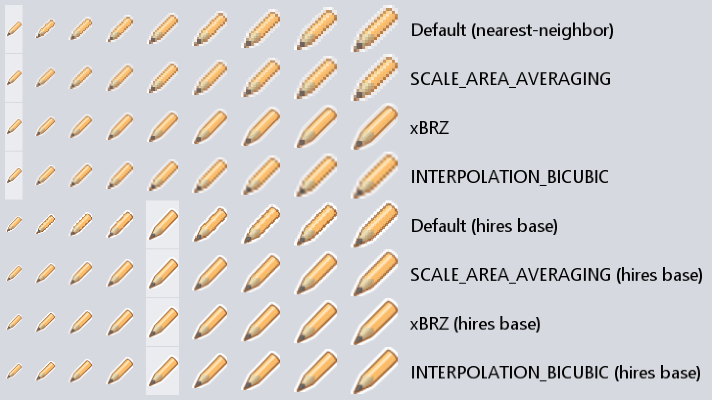
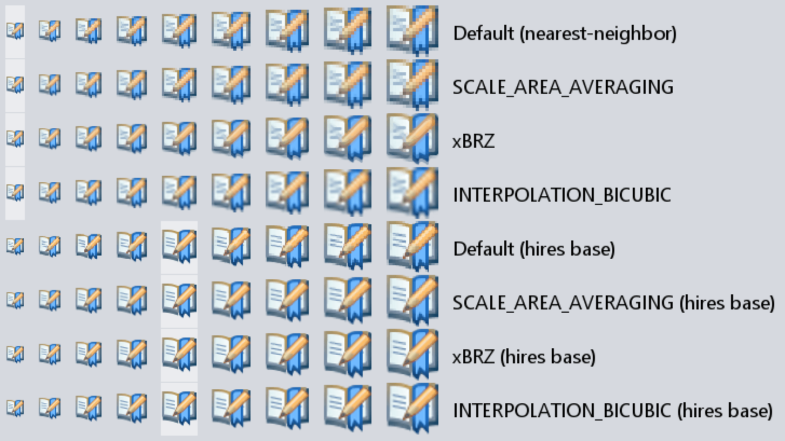

# xBRZ in Java

[xBRZ](https://sourceforge.net/projects/xbrz/): "Scale by rules" - high quality image upscaling filter by Zenju.

Java port of xBRZ 1.8 by Stanio.

## Modules

-   [xbrz-core](xbrz-core)
-   [xbrz-awt](xbrz-awt)
-   [xbrz-tool](xbrz-tool)

## Demo

The following is just an approximation due to viewing conditions such as screen
resolution and browser image interpolation.

The highlighted column is the base (no scaling applied) image:

xBRZ upscaling provides crisp edges and reconstructed detail.  Images are
upscaled to an integral factor producing a resultion ≥ target resolution.  They
may be then downscaled to the exact target resolution as necessary using a
smooth interpolation.

One may notice downscaling a hires base image using a smooth algorithm (bilinear, bicubic) generally produces better, more detailed results vs. upscaling a lores
base image.  Having a source hires variant could make xBRZ unnecessary.
